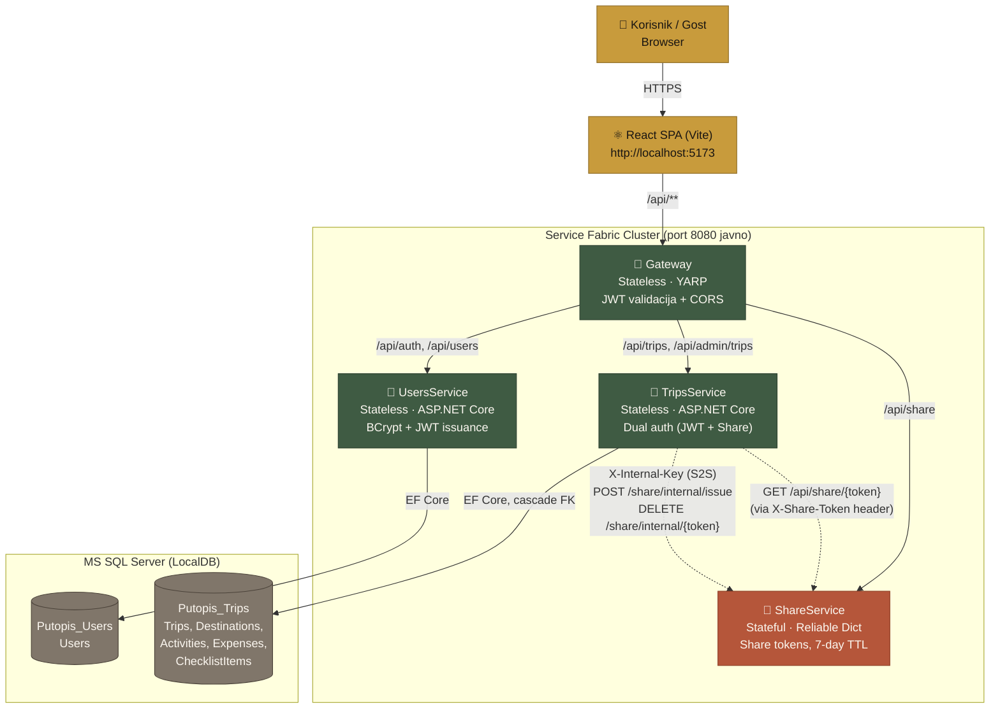
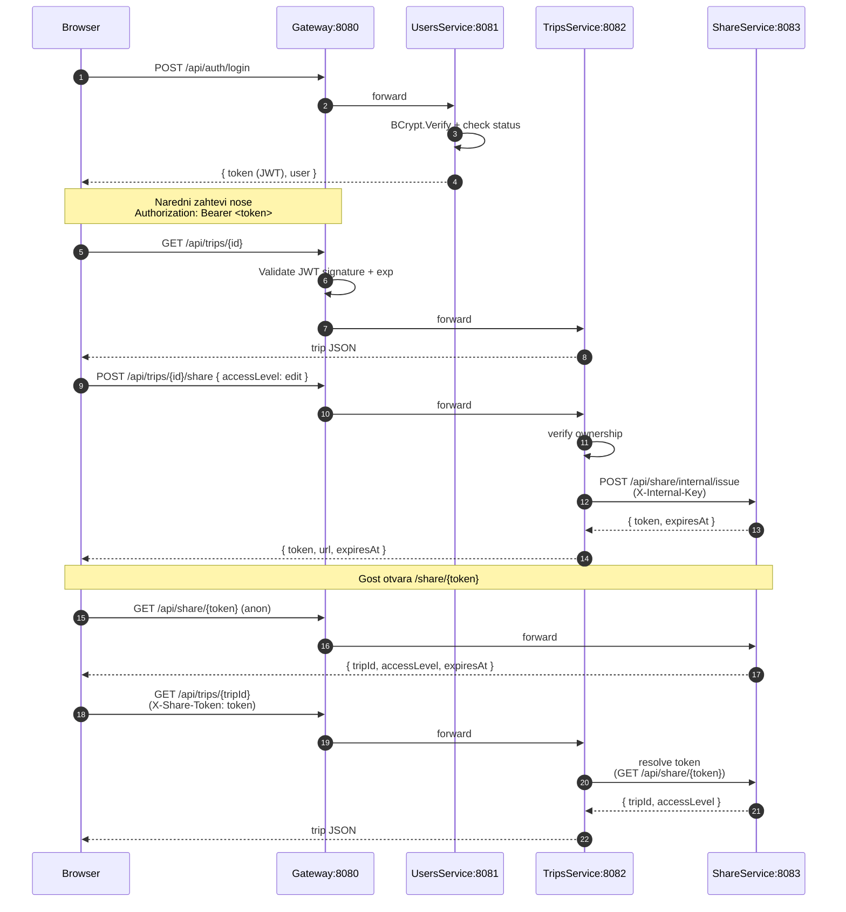
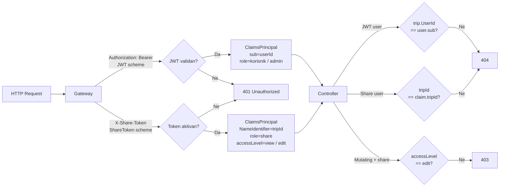
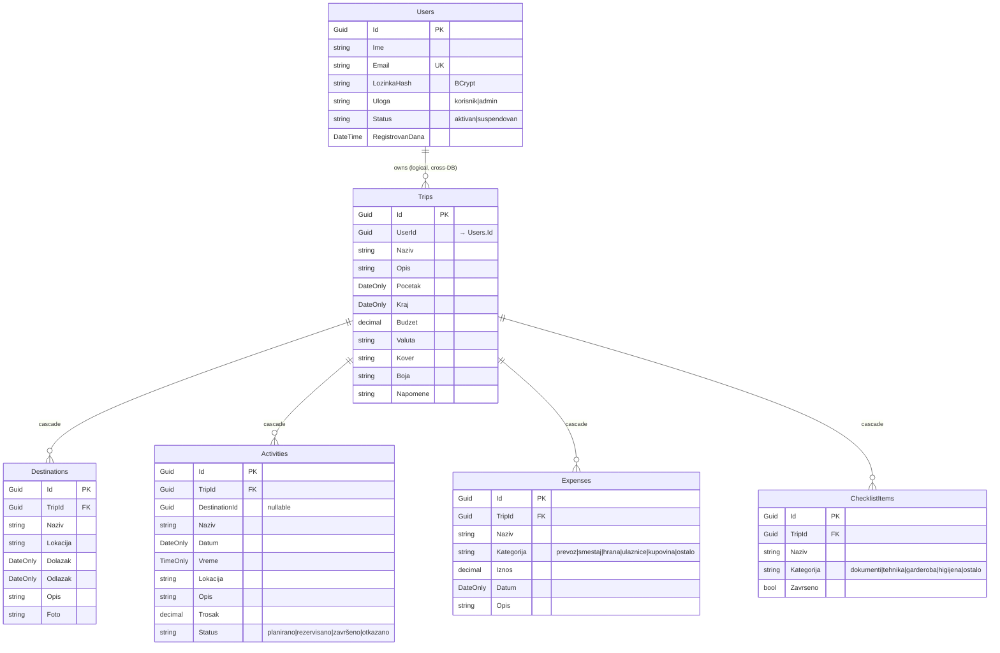

# Putopis — Arhitektura

## Pregled servisa

## Tok zahteva

## Sloj autentifikacije

## Baza podataka

ShareTokens **nisu** u SQL bazi — žive u `IReliableDictionary<string, ShareTokenState>` unutar StatefulService-a. U lokalnom razvojnom modu se koristi `ConcurrentDictionary` koji ne preživljava restart procesa.
