# Putopis — Use Case dijagram

## Akteri

- **Gost** — neprijavljen korisnik
- **Korisnik** — prijavljen korisnik (uloga `korisnik`)
- **Admin** — prijavljen korisnik (uloga `admin`)
- **Saradnik (token)** — anonimni korisnik kome je deljen token (view/edit)

## Use cases

```mermaid
graph LR
    Gost((👤 Gost))
    Korisnik((👤 Korisnik))
    Admin((👑 Admin))
    Saradnik((🔗 Saradnik<br/>preko share<br/>tokena))

    subgraph Auth ["Autentifikacija"]
        UC1[Registracija]
        UC2[Prijava]
        UC3[Odjava]
    end

    subgraph Trips ["Upravljanje planovima"]
        UC4[Kreiranje plana]
        UC5[Pregled svojih planova]
        UC6[Izmena plana]
        UC7[Brisanje plana<br/>kaskadno]
    end

    subgraph Nested ["Detalji plana"]
        UC8[Dodavanje destinacije]
        UC9[Dodavanje aktivnosti]
        UC10[Dodavanje troška]
        UC11[Dodavanje stavke<br/>na checklist]
        UC12[Toggle checklist stavke]
        UC13[Dnevni raspored<br/>lista + kalendar]
    end

    subgraph Sharing ["Deljenje"]
        UC14[Generisanje share tokena<br/>VIEW ili EDIT]
        UC15[Deljenje QR koda<br/>preuzimanje SVG]
        UC16[Otvaranje deljenog plana<br/>anonimno]
        UC17[Editovanje preko<br/>EDIT tokena]
    end

    subgraph Export ["Izvoz"]
        UC19[PDF pregled]
        UC20[PDF preuzimanje]
    end

    subgraph AdminUC ["Administracija"]
        UC21[Pregled svih korisnika]
        UC22[Suspendovanje korisnika]
        UC23[Brisanje korisnika]
        UC24[Pregled svih planova]
        UC25[Pregled statusa servisa]
    end

    Gost --> UC1
    Gost --> UC2
    Korisnik --> UC3
    Korisnik --> UC4
    Korisnik --> UC5
    Korisnik --> UC6
    Korisnik --> UC7
    Korisnik --> UC8
    Korisnik --> UC9
    Korisnik --> UC10
    Korisnik --> UC11
    Korisnik --> UC12
    Korisnik --> UC13
    Korisnik --> UC14
    Korisnik --> UC15
    Korisnik --> UC19
    Korisnik --> UC20

    Saradnik --> UC16
    Saradnik --> UC17

    Admin --> UC3
    Admin --> UC4
    Admin --> UC5
    Admin --> UC6
    Admin --> UC7
    Admin --> UC21
    Admin --> UC22
    Admin --> UC23
    Admin --> UC24
    Admin --> UC25

    classDef gost fill:#80766A,stroke:#4A4239,color:#FBF7F0
    classDef korisnik fill:#3F5B43,stroke:#2C4030,color:#FBF7F0
    classDef admin fill:#B5563A,stroke:#8E3F26,color:#FBF7F0
    classDef saradnik fill:#C89B3C,stroke:#8E6D29,color:#1A1612

    class Gost gost
    class Korisnik korisnik
    class Admin admin
    class Saradnik saradnik
```

## Najvažnija pravila autorizacije

| Use case                              | Akter                  | Provera                                                       |
|---------------------------------------|------------------------|---------------------------------------------------------------|
| Pregled/izmena plana                  | Korisnik               | `Trip.UserId == JWT.sub`                                      |
| Brisanje plana                        | Korisnik               | `Trip.UserId == JWT.sub`, kaskadno briše sve dete entitete    |
| Otvaranje deljenog plana              | Saradnik (token)       | Token postoji u Reliable Dictionary i nije istekao            |
| Edit preko share tokena               | Saradnik (token)       | `accessLevel == "edit"` i `URL.tripId == token.tripId`        |
| Lista korisnika                       | Admin                  | `JWT.role == "admin"` (`[Authorize(Roles="admin")]`)          |
| Suspendovanje samog sebe              | Admin                  | Blokirano (`400`)                                             |
| Login suspendovanog korisnika         | —                      | `401 Unauthorized` ("Vaš nalog je suspendovan.")              |

## Validacijska pravila (FluentValidation + ručno u kontrolerima)

- `Trip.Kraj >= Trip.Pocetak`
- `Trip.Budzet >= 0`
- `Destination.Odlazak >= Destination.Dolazak`
- `Expense.Iznos >= 0`
- `Activity.Datum ∈ [Trip.Pocetak, Trip.Kraj]`
- `Activity.Trosak >= 0`
- Email format (DataAnnotations)
- `Lozinka.Length >= 6`
- `Status ∈ {aktivan, suspendovan}`
- `AccessLevel ∈ {view, edit}`
